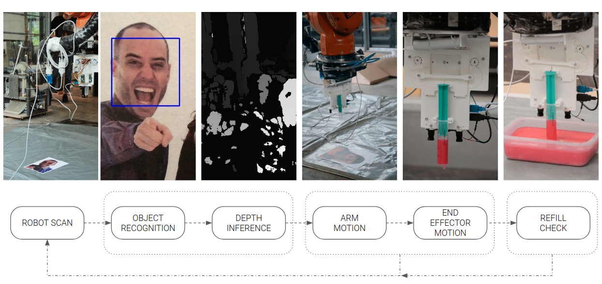
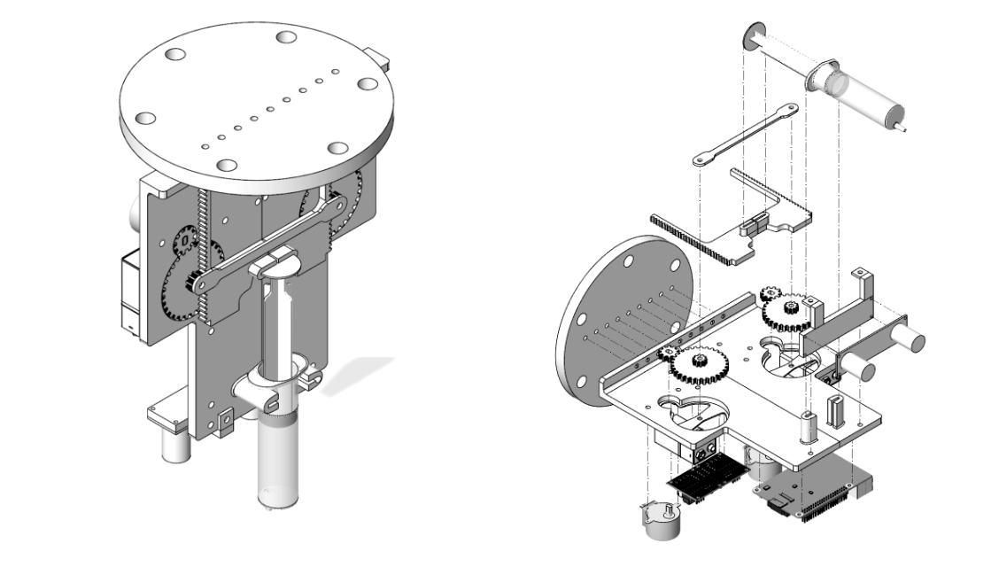
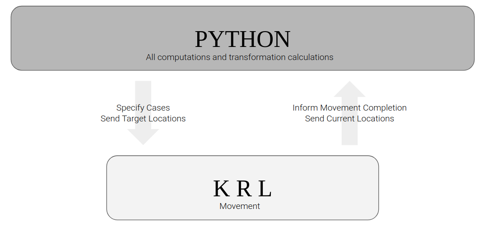
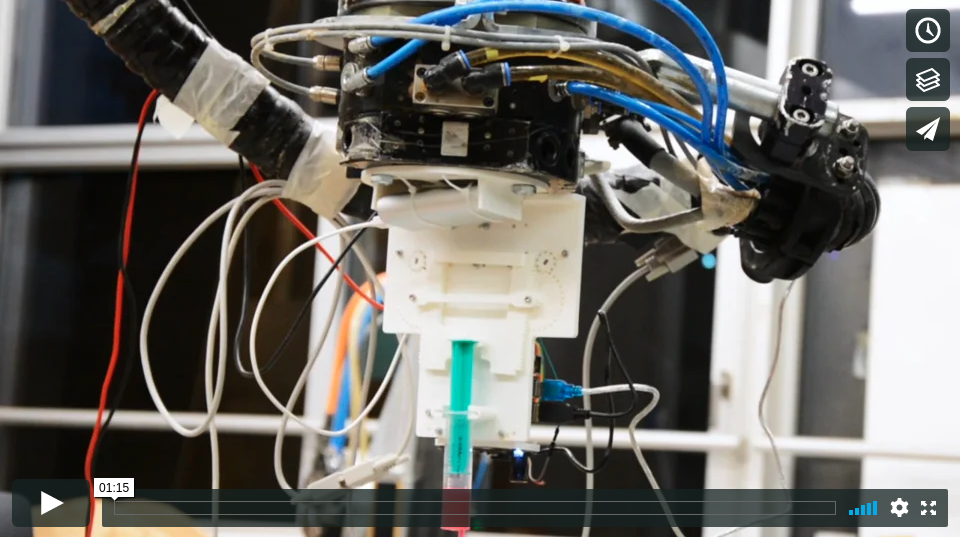
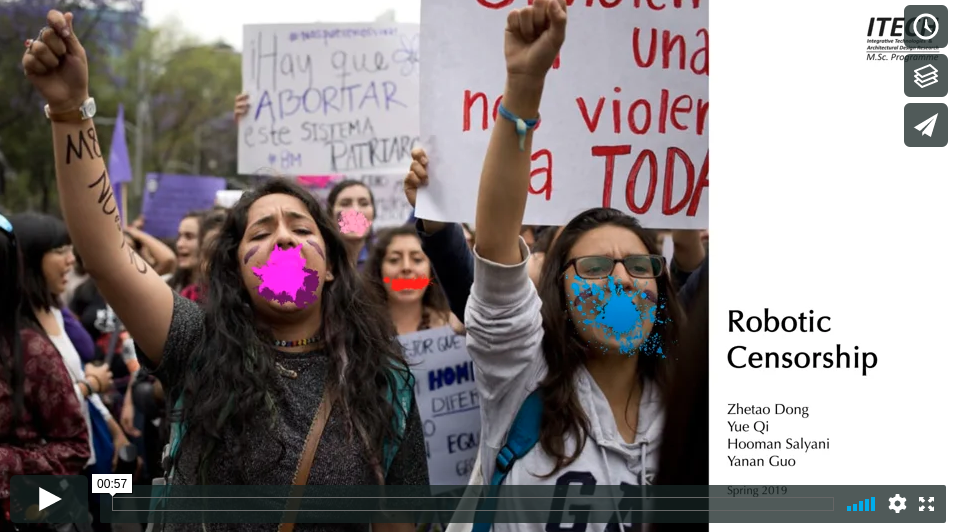

# Robotic Censorship

This is a final project of 2019 CDDF seminar (computational design and digital fabrication) at University of Stuttgart.

> This project use use robot and object recognition algorithm to apply a block of paint for censorship.

The robot has a stereo camera module equipped on its end-effector for object detection and depth inference, as well as two stepper motors and gear system for applying the paint.

The robot goes to some pre-defined scanning locations and takes the scan. If any human face is found, it goes above that face and paint on it, otherwise it goes to next scan location. If there is little paint left in the syringe, it performs the auto-reload.

Hardware:

- Raspberry Pi 3B+
- Stereo camera module
- Stepper Motors
- Gear and rack
- Syringe

Software:

- OpenCV (python wrapper)
- Tensorflow (not used in the end)

Process:

End_effector:

Communication with the KUKA robot:

Full video:

